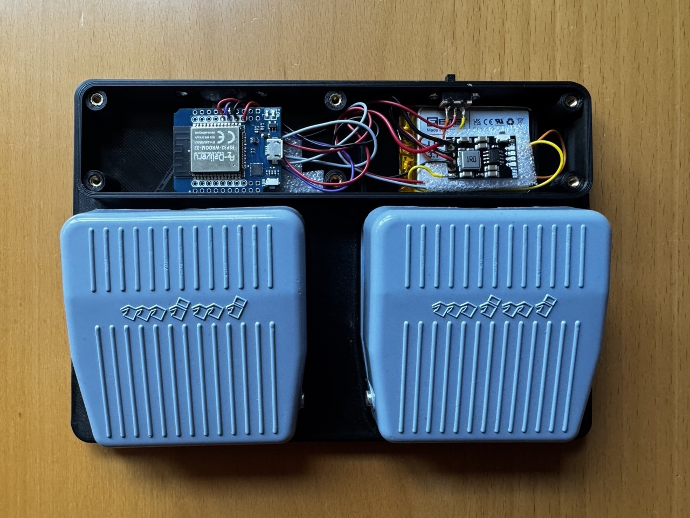
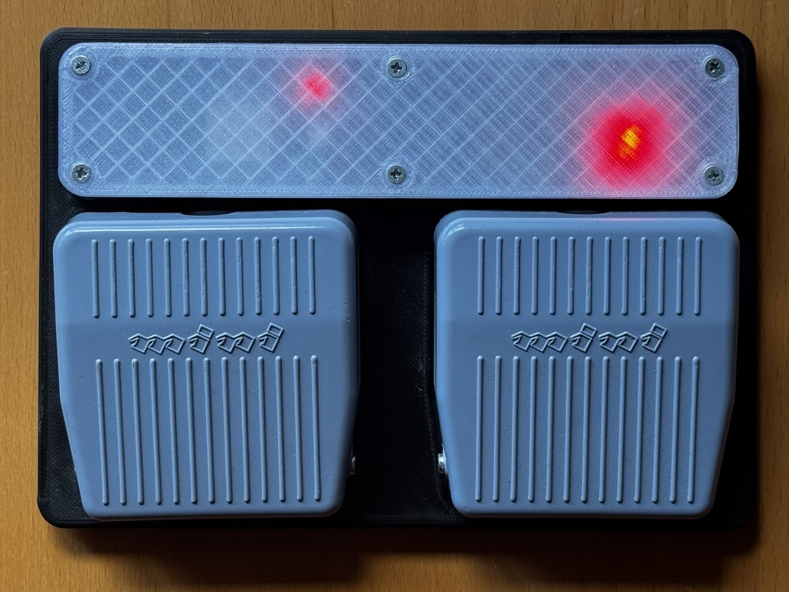

# BLE page turner

An ESP32 based BLE page turner (not only) for musicians.

It acts as a bluetooth keyboard, which can send ten different key strokes to the device to which it is connected.

This page turner is inspired by <https://github.com/raichea/LOLIN32-BT-Page-Turner>. I used his model from thingiverse <https://www.thingiverse.com/thing:4880077>, because I liked the solid pedals that it uses. I added a charging chip and wired up the power switch so that the ESP32 either runs off the battery or it runs off the USB-C connector while the battery is charged.

I printed the lid in transparend PLA so the LEDs of the ESP and of the charging circuit are visible and allow me to see the connection state and the state of charge of the battery. This way I don't need software to monitor the battery via the ESP's ADC. The battery is a 1100 mAh LiPo. I never measured exactly how long the device runs on a full charge but it always lasts me more than two rehearsal evenings/sessions, which means at least four hours.

@raichea got all his parts from aliexpress, I got mine from amazon.de. Here's just a link to the pedals: <https://www.amazon.de/dp/B07X6CW5HS>

The pedals work well, but I found the original 240V switches to have a terribly noisy click. So I replaced them with micro switches, which I still had lying around and designed a 3D model which supports the micro switches inside the pedals.

The software is using a finite state machine. This allows it to send ten diffent key presses to the connected device. The keys are sent when a pedal is released.

There are two basic actions:

* Pedal down (press the pedal for less than a second).
* Pedal hold (hold the pedal for more than a second).

These can be combined using both pedals:

* Press or hold both pedals simultaneously.
* Hold one pedal down first and press the other pedal while holding the first.

The key strokes sent to the device are:

| Key stroke | Pedal action |
|------------|--------------|
| Arrow up   | Press the left pedal |
| Page up    | Hold the left pedal |
| Arrow down | Press the right pedal|
| Page down  | Hold the right pedal |
| Left Ctrl  | Press both pedals |
| Right Ctrl | Hold both pedals |
| Right Alt  | Hold the left pedal and then press the right |
| Right Shift| Hold the left pedal and then hold the right |
| Left Alt   | Hold the right pedal and then press the left |
| Left Shift | Hold the right pedal and then hold the left |

Depending on how flexible your page turner software is, you may be able to use all these keystrokes. Most software should be able to handle at least the first four. In case you need different key bindings, just change the definition in main.cpp.
